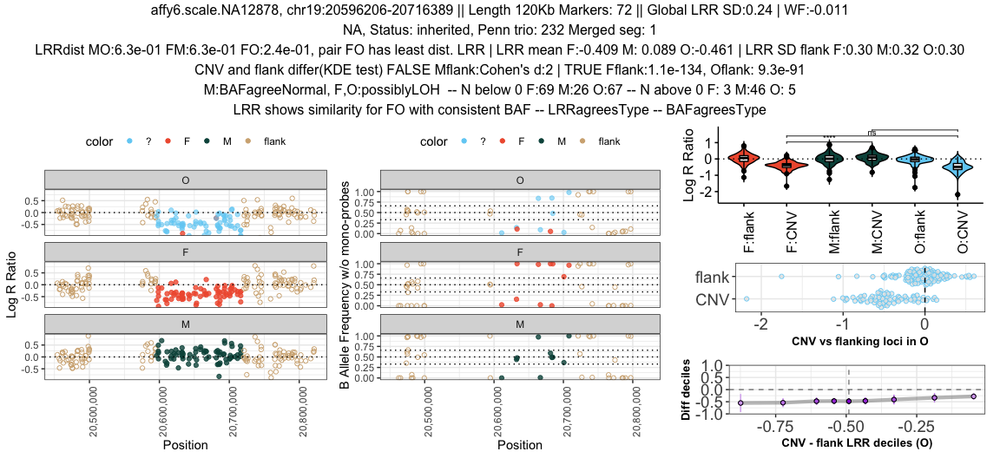
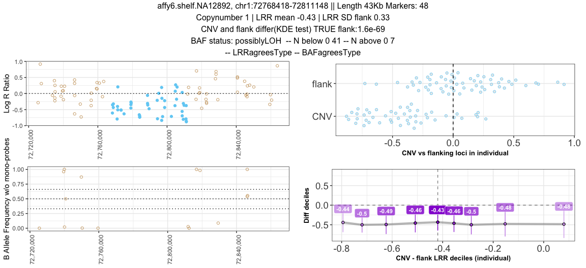

SeeCiTe: Seeing CNVs in Trios
-----------------------------

SeeCiTe is a novel CNV quality control tool that post-processes output from current CNV calling tools exploiting child-parent trio data to classify calls in quality categories and provide a set of visualizations for each putative CNV call in the offspring. It utilizes probe-level CNV data in trios (and singletons) to systematically highlight potential artefacts and visualize signal intensities in a streamlined fashion suitable for biobank scale studies.

This vignette describes all steps necessary to run SeeCiTe analysis,
using the public HapMap trio data, with intermidiate outputs supplied
with the package for the:

- trio data (#Step-I-.-Preparing-the-input-files)
- singleton data (#Single-sample-functionality)

Installation.
-------------

Make sure the dependencies are installed fist:

``` r
generic_packages <- c("magrittr", "dplyr", "tidyr", "tools", "purrr", "utils", "rlang", "bedr")
plotting_packages <- c("ggplot2", "scales", "gridExtra", "cowplot", "rogme", "ggpubr")
stat_packages <- c("statip", "outliers", "effsize", "lawstat", "ks")
packages <- c(generic_packages, plotting_packages, stat_packages)

if (length(setdiff(packages, rownames(installed.packages()))) > 0) {
  install.packages(setdiff(packages, rownames(installed.packages())))  
}

library(devtools)
devtools::install_github('davetang/bedr')
devtools::install_github("GRousselet/rogme")
```

Use devtools package to install directly from GitHub (by default it will
force the upgrade of the installed packages, which might be undesirable,
then set dependencies to FALSE):

``` r
devtools::install_github("aksenia/SeeCiTe", dep = FALSE)
```

Step I. Preparing the input files
----------------------------------

The preparation step takes in 1) an original PennCNV-trio output
(produced by running PennCNV’s detect\_cnv.pl with the -trio flag) and
2) merged and/or filtered by frequency and size file in a standard
PennCNV format (PennCNV’s clean\_cnv.pl will do the segment merging
automatically and output a file in such format). The merged file defines
the CNVs to analyse in terms of boundaries and loci covered, e.g. all
CNVs that are in the first file but do not overlap with the CNVs in the
second file will be ignored.

The function *runExtractInheritance* will take these two input files and
produce additional intermediate files, necessary for consequent steps,
shown below, with the prefix of the merged file:

    # Loading SeeCiTe

``` r
library(SeeCiTe)
# PennCNV-trio output
file_original <- system.file("extdata", "affy6ceu.original.triocnv", package = "SeeCiTe")
# PennCNV merge output
file_merged <- system.file("extdata", "affy6ceu.merged.filtered.triocnv", package = "SeeCiTe")
# Input files for SeeCiTe
input_files <- runExtractInheritance(filename_orig = file_original, filename_merged = file_merged)
```

The input files now contain CNVs to analyse for each offspring and
inheritance, decoded from PennCNV-trio HMM state. The merging log is
also created to keep track whether a CNV was merged and if so, how many
segments were merged.

``` r
print(input_files)
# $triocnv_file
# [1] "SeeCiTe/inst/extdata/affy6ceu.merged.filtered_annot_offspring.triocnv"
# 
# $merge_trace
# [1] "SeeCiTe/inst/extdata/affy6ceu.merged.filtered_merge.log"
dir <- dirname(file_original)
# Intermidiate files for the reference of inheritance mapping.
list.files(dir, pattern = tools::file_path_sans_ext(basename(file_merged)), full.names = F)
# [1] "affy6ceu.merged.filtered.triocnv"                
# [2] "affy6ceu.merged.filtered_annot.triocnv"          
# [3] "affy6ceu.merged.filtered_annot_offspring.triocnv"
# [4] "affy6ceu.merged.filtered_merge.log"              
# [5] "affy6ceu.merged.filtered_unmaskedstatus.triocnv"
```

Step II. Prepare and extract SNP data.
--------------------------------------

For the extraction of the SNP-level data for each individual in a trio
the following inputs are needed: 1) PFB file (same file with probe
coordinates used when running PennCNV); 2) full path to PennCNV
installation; 3) File with paths to LRR and BAF signal files in a
tab-separated format in the order father, mother, offspring (same as in
PennCNV-trio); 4) A parameter setting how many probes in flanks to
extract; 5) dataset name - it must be consistent and will be used for
file naming throughout the project; 6) full path to the directory in
which the extracted SNP data will be stored, for each CNV (must be
created in advance).

``` r
pfb_file <- file.path("~/Documents/uib/dev/toydata/affygw6.hg19.sorted.pfb")
penn_path <- "~/local/PennCNV1.0.4"
penn_trio_list <- file.path("~/Documents/uib/dev/toydata/affy6hm_trio.tab")
n_flanking_snp <- 5
run_dir <- "~/Documents/uib/dev/toydata/dev"

commands <- makePythonCommands(penn_path=penn_path, 
                               pfb_file=pfb_file, 
                               penn_trio_list=penn_trio_list, 
                               triocnv_file=input_files[["triocnv_file"]],
                               n_flanking_snp=5, 
                               dataset="affy6ceu", 
                               run_dir=run_dir)
print(commands)
# $cnv
# [1] "python3 SeeCiTe/inst/python/extract_snp_cnv.py -l ~/Documents/uib/dev/toydata/affy6hm_trio.tab -c SeeCiTe/inst/extdata/affy6ceu.merged.filtered_annot_offspring.triocnv -d affy6ceu -p ~/Documents/uib/dev/toydata/affygw6.hg19.sorted.pfb -s ~/local/PennCNV1.0.4 -o ~/Documents/uib/dev/toydata/dev"
# 
# $flank
# [1] "python3 SeeCiTe/inst/python/extract_snp_flanks.py -l ~/Documents/uib/dev/toydata/affy6hm_trio.tab -c SeeCiTe/inst/extdata/affy6ceu.merged.filtered_annot_offspring.triocnv -d affy6ceu -p ~/Documents/uib/dev/toydata/affygw6.hg19.sorted.pfb -s ~/local/PennCNV1.0.4 -o ~/Documents/uib/dev/toydata/dev -f 5"
```

The result will be two script files with one line per CNV with a command
for PennCNV infer\_snp\_allele.pl that will do the extraction,
terminating by lines that collect the data into one table for the whole
cohort. This must be run by the user. For large cohorts one can split
the commands into batches or submit to a cluster.

Step III. Gather and read in all input.
---------------------------------------

The previous step extracts SNP data into files in the provided
*run\_dir*: files with prefix *probecoord.txt*, *snp\_flank.txt* and
*snp\_cnv.log*. The main CNV file is *triocnv\_file* in *input\_data*
object, while *merge\_trace* is the merging log in the same object.
Finally, *cnv\_qcsum\_file* is the QC summary output of PennCNV. The
*cache\_id* tells where R should store cache for core calculations.

``` r
args <- list(triocnv_file=input_files[["triocnv_file"]],
             probecoord_file=system.file("extdata", "affy6ceu.probecoord.txt", package = "SeeCiTe"),
             snp_flank_file=system.file("extdata", "affy6ceu.snp_flank.txt", package = "SeeCiTe"),
             snp_cnv_log_file=system.file("extdata", "affy6ceu.snp_cnv.log", package = "SeeCiTe"),
             cnv_qcsum_file=system.file("extdata", "affy6ceu.qcsum", package = "SeeCiTe"),
             dataset="affy6ceu",
             cache_id="~/Documents/uib/dev/toydata",
             merge_trace=input_files[["merge_trace"]])
```

Now all inputs are in order and can be read and formatted:

``` r
main_dt <- readInputs(args = args)
# [1] "Reading merged formatted PennCNV trio file for offspring SeeCiTe/inst/extdata/affy6ceu.merged.filtered_annot_offspring.triocnv"
# [1] "Reading probes file SeeCiTe/inst/extdata/affy6ceu.probecoord.txt"
# [1] "Collapsing duplicate probes"
# [1] "Annotating probes in CNV loci"
# [1] "Reading extracted intensity for flanking regions SeeCiTe/inst/extdata/affy6ceu.snp_flank.txt"
# 
#    denovo inherited 
#         6        43 
# [1] "Reading denovo test results for CNV regions SeeCiTe/inst/extdata/affy6ceu.snp_cnv.log"
# [1] "Reading quality summary file SeeCiTe/inst/extdata/affy6ceu.qcsum"
# [1] "Reading merging log file SeeCiTe/inst/extdata/affy6ceu.merged.filtered_merge.log"
candidateCnvs <- main_dt[["data"]]
```

Step IV. Run SeeCiTe classification.
------------------------------------

First, a summary statistic collection step, for each CNV in offspring:

``` r
clu_baf <- runAnalyzeSignal(input_data = candidateCnvs, args = args, use_cache = T)
# [1] "Found cached file ~/Documents/uib/dev/toydata/affy6ceu_clu_baf.rds, reading in"
head(clu_baf[,c(1:4)], n=3)
# # A tibble: 3 x 4
#   cnvTypeBAF    relation nprobes33_66 nprobes_cn4
#   <chr>         <chr>           <int>       <int>
# 1 F:possiblyLOH F                   0           0
# 2 M:possiblyLOH M                   0           0
# 3 O:possiblyLOH O                   0           0
```

The clasification is the final step in the analysis which annotates each
CNV with suggested inheritance and SeeCiTe quality class.

``` r
cnv_class <- classifyTrios(clu_baf)
with(cnv_class, table(seecite, inheritanceTest))
#             inheritanceTest
# seecite      denovo inherited mosaic unclear
#   borderline      3         0      3      19
#   probable        0        18      0       0
#   unlikely        3         3      0       0
```

Step V. Visualize and write summary files.
------------------------------------------

The results can be visualized either for each single CNV region or for a
whole cohort:

``` r
Sample <- "affy6.scale.NA12878"
Cnv <- "chr19:20596206-20716389"
plotRawTrio(input_data = candidateCnvs %>% dplyr::filter(sample==Sample, coordcnv==Cnv), 
            sifted_data = clu_baf %>% dplyr::filter(sample==Sample, coordcnv==Cnv), 
            penn_qcsum = main_dt[["qcsum"]] %>% dplyr::filter(sample==Sample),
            merge_trace = main_dt[["merge"]] %>% dplyr::filter(sample==Sample, coordcnv==Cnv))
```



This will write a pdf file with such plots per SeeCiTe category:

``` r
plotCohort(main_data=main_dt,
           sifted_data=clu_baf,
           classified_data=cnv_class,
           output_dir = "~/Documents/uib/dev/toydata/affy6ceu_viz",
           dataset="affy6ceu",
           subset_nprobes=20,
           subset_length=150000)
```

Finally, the summary statistics and SeeCiTe classifications can be
written out as plain text files, together with bed (UCSC 6-column style)
and plink formatted CNV regions:

``` r
writeSeecite(classified_data=cnv_class,
          output_dir = "~/Documents/uib/dev/toydata/affy6ceu_viz",
          dataset="affy6ceu")
```


Single sample functionality
----------------------------------

The SeeCite core algorithm is based on comparison of intensity
distributions between the individuals in a trio. However there is a
number of individual-level metrics that can be useful out of trio
context. We extended the tool functionality to process the single
samples data and calculate these metrics. The adapted simplified
plotting function is also available.

First step is to extract the signal intensities with a helper script
*extract\_snp\_single.py*, which takes as input PennCNV format and a
sample map (one line per sample, comma-separated,
“sampleid,path/to/lrrbaf\_file”):

``` r
python3 extract_snp_single.py -c data/affy6hm.initial_merged.triocnv -m data/samples_map.txt -o data -d SNGL -f 30
```

The output file *data/SNGLE.signal\_flanks\_30.txt* (provided with the
package sample data) will contain all the information needed for
consequent steps:

``` r
single_file =  system.file("extdata", "SNGLE.signal_flanks_30.txt", package = "SeeCiTe")
single_data <- readSingle(snp_file = single_file)
head(single_data, n = 2)
# # A tibble: 2 x 13
#   Name    Chr Position locus coordcnv sample copynumber numsnp relation Origin
#   <chr> <int>    <int> <chr> <chr>    <chr>       <int>  <int> <chr>    <lgl> 
# 1 AFFX…     6 32412480 flank chr6:32… affy6…          1     18 O        NA    
# 2 AFFX…     6 32412480 flank chr6:32… affy6…          1     18 O        NA    
# # … with 3 more variables: type <chr>, parameter <chr>, value <dbl>
```

``` r

sclu_baf <- runAnalyzeSignal(single_data, 
                             args = list(cache_id="~/Documents/uib/dev/toydata",
                                   dataset="SNGLE"), 
                             single = T,
                             use_cache = T)
# [1] "Found cached file ~/Documents/uib/dev/toydata/SNGLE_clu_baf.rds, reading in"
scnv_class <- classifySingles(sclu_baf)

Sample <- "affy6.shelf.NA12892"
Cnv <- "chr1:72768418-72811148"
plotSingle(input_data = single_data %>% dplyr::filter(sample==Sample, coordcnv==Cnv),
           sifted_data = sclu_baf %>% dplyr::filter(sample==Sample, coordcnv==Cnv),
           print_title = T)
```



To write out multiple plots: 

``` r
plotCohort(main_data=list(data=single_data),
           sifted_data=sclu_baf,
           classified_data=scnv_class,
           output_dir = "~/Documents/uib/dev/toydata/single_viz",
           dataset="SNGLE",
           single = TRUE)
```

Credits
-------

If you use this package, please cite “SeeCiTe: a method to assess CNV
calls from SNP arrays using trio data”, Ksenia Lavrichenko, Øyvind
Helgeland, Pål R Njølstad, Inge Jonassen, Stefan Johansson bioRxiv
2020.09.28.316372; doi:
<a href="https://doi.org/10.1101/2020.09.28.316372" class="uri">https://doi.org/10.1101/2020.09.28.316372</a>
